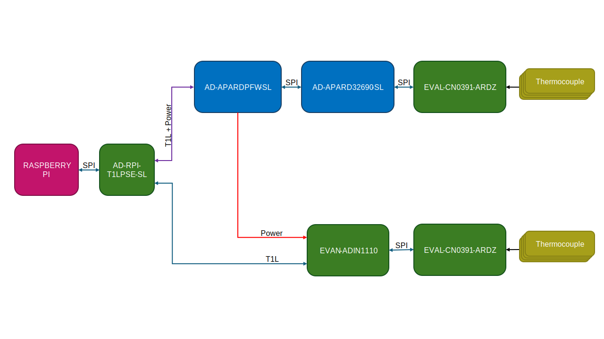
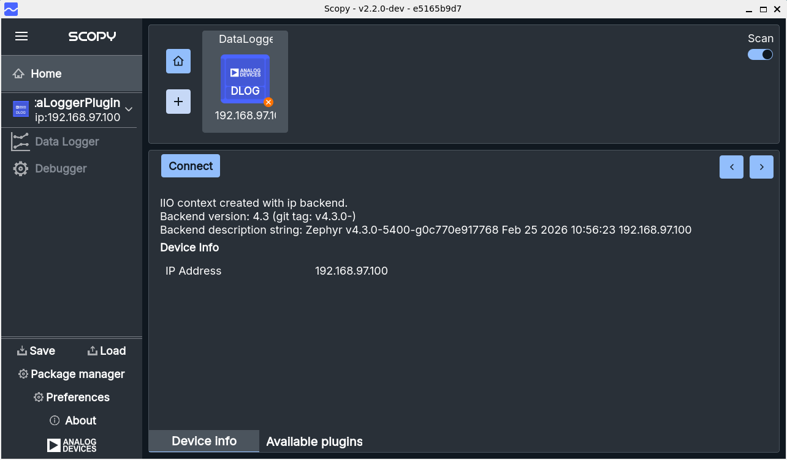

Enabling Flexible Data Acquisition Across Mixed Vendor Compute Platforms
================================================================================

ADI DataX™ unifies application portability across heterogeneous
compute environments, enabling reusable workflows for data acquisition and
processing. Developers can scale complexity as needed, from rapid prototyping to
advanced system refinement. The solution highlights modularity, consistency, and
efficiency in building multi‑vendor data pipelines. This approach significantly 
reduces integration overhead and accelerates product development.

Resources
--------------------------------------------------------------------------------
- Zephyr: :git-zephyr:`ZEPHYR_PROJECT_NAME <ZEPHYR_PROJECT_NAME:>`
- no-OS: :git-noos:`NO_OS_PROJECT_NAME <NO_OS_PROJECT_NAME:>`
- Linux: :git-linux:`LINUX_PROJECT_NAME <LINUX_PROJECT_NAME:>`
- Hardware: 
  
  - :adi:`AD-APARD32690-SL Rev. E <ad-apard32690-sl>`
  - :adi:`AD-APARDPFW-SL <ad-apardpfw-sl>`
  - :adi:`EVAL-ADIN1110 <eval-adin1110>`
  - :adi:`EVAL-CN0391-ARDZ <cn0391>`
  - :adi:`AD-RPI-T1LPSE-SL <ad-rpi-t1lpse-sl>`

Block diagram
--------------------------------------------------------------------------------

Demo description
--------------------------------------------------------------------------------
This demo illustrates the flexibility of ADI DataX™ in enabling data acquisition
across mixed vendor compute platforms. The system integrates ADI's data 
acquisition hardware with a variety of compute platforms, including Zephyr RTOS 
and no-OS. The demo showcases the seamless connectivity and data flow between 
the hardware and software components, demonstrating how developers can easily 
build and deploy data acquisition workflows across different environments. By 
leveraging ADI DataX™, developers can focus on application development without 
worrying about the complexities of integration, enabling faster time-to-market 
for their products.

In this demo setup, the Raspberry Pi, running :adi:`Kuiper 2 <kuiper>`, serves
as the central aggregation unit, communicating with the ADI hardware components
to acquire data using the  :adi:`AD-RPI-T1LPSE-SL <ad-rpi-t1lpse-sl>` via T1L
connections.

The :adi:`AD-RPI-T1LPSE-SL <ad-rpi-t1lpse-sl>` powers the :adi:`AD-APARDPFW-SL <ad-apardpfw-sl>`
which powers the :adi:`AD-APARD32690-SL <ad-apard32690-sl>` and forwards power 
to the :adi:`EVAL-ADIN1110 <eval-adin1110>`.

To demonstrate the flexibility of DataX™, the :adi:`AD-APARD32690-SL <ad-apard32690-sl>`
runs Zephyr RTOS, while the :adi:`EVAL-ADIN1110 <eval-adin1110>` runs no-OS. 
Both of the boards have an :adi:`EVAL-CN0391-ARDZ <cn0391>` connected to them, 
which is used to read the temperature using 4 thermocouples each.
The system can be interchanged, by simply compiling the Zephyr application for
the :adi:`EVAL-ADIN1110 <eval-adin1110>` and the no-OS application for the
:adi:`AD-APARD32690-SL <ad-apard32690-sl>`, demonstrating the ease of using
DataX™ in enabling data acquisition across mixed vendor compute platforms.

Required Hardware
--------------------------------------------------------------------------------

.. csv-table::
    :file: hardware_table.csv

Building steps
--------------------------------------------------------------------------------

Raspberry Pi
^^^^^^^^^^^^^^^^^^^^^^^^^^^^^^^^^^^^^^^^^^^^^^^^^^^^^^^^^^^^^^^^^^^^^^^^^^^^^^^^

For detailed instructions on configuring the Raspberry Pi with the
:adi:`AD-RPI-T1LPSE-SL <ad-rpi-t1lpse-sl>`, please refer to the
:ref:`ad-rpi-t1lpse-sl` documentation:

- :ref:`software-setup` - Building and flashing the Micro-SD card
- :ref:`setting-up-static-ip` - Configuring a static IP address

Zephyr RTOS
^^^^^^^^^^^^^^^^^^^^^^^^^^^^^^^^^^^^^^^^^^^^^^^^^^^^^^^^^^^^^^^^^^^^^^^^^^^^^^^^
This project builds an Industrial I/O Daemon (iiod) with network support on the 
APARD32690 platform. It enables remote access to industrial I/O devices over the 
network using the Libiio v.1.0 library run on Zephyr RTOS.
The monitored device here is an ad7124 which exposes 4 virtual channels for 
reading the temperature from 4 different Type K thermocouples. 
The data can be visualized using Scopy, which connects to the iiod running on the 
APARD32690 board.

Setting Up the Zephyr Environment
~~~~~~~~~~~~~~~~~~~~~~~~~~~~~~~~~~~~~~~~~~~~~~~~~~~~~~~~~~~~~~~~~~~~~~~~~~~~~~~~

Getting Libiio
~~~~~~~~~~~~~~~~~~~~~~~~~~~~~~~~~~~~~~~~~~~~~~~~~~~~~~~~~~~~~~~~~~~~~~~~~~~~~~~~

Get the latest version of Libiio into the Zephyr project by updating *west.yml*. 
Add the following lines under `remotes`:

.. code-block:: yaml

   manifest:
    - name: libiio
      url-base: https://github.com/analogdevicesinc

Add the following lines under `projects`:

.. code-block:: yaml

    - name: libiio                                                                                    
      path: modules/lib/libiio
      revision: main

Run this command to update the Zephyr project with the new manifest:

.. shell::
   :user: analog
   :group: analog
   :show-user:

   ~/zephyrproject/zephyr
   $west update

You should now have Libiio in the Zephyr project under *modules/lib/libiio*.

Build and Run
~~~~~~~~~~~~~~~~~~~~~~~~~~~~~~~~~~~~~~~~~~~~~~~~~~~~~~~~~~~~~~~~~~~~~~~~~~~~~~~~
After activating the virtual environment, build the application using the following command:

.. shell::
   :user: analog
   :group: analog
   :show-user:

   ~/zephyrproject/zephyr   
   $west build -p always -b apard32690/max32690/m4 ../modules/lib/libiio/zephyr/samples/iiod/ -S iiod-network --shield eval_cn0391_ardz --shield ad_apardpfw_sl

Then flash:

.. shell::
   :user: analog
   :group: analog
   :show-user:
   
   ~/zephyrproject/zephyr
   $~/MaximSDK/Tools/OpenOCD/openocd -s ~/MaximSDK/Tools/OpenOCD/scripts/ -f interface/cmsis-dap.cfg -f target/max32690.cfg -c "program ./build/zephyr/zephyr.hex verify reset exit"

By connecting to the serial communication of the board (e.g.: ``minicom -D /dev/ttyACM0 -b 115200``) and resetting, the following output should be observed:

.. code-block::

   Hello World! apard32690/max32690/m4
   [00:00:00.176,000] <inf> phy_adin: PHY 1 ID 283BCA1
   [00:00:00.178,000] <inf> phy_adin: PHY 1 2.4V mode supported
   [00:00:00.180,000] <inf> phy_adin: PHY 2 ID 283BCA1
   [00:00:00.182,000] <inf> phy_adin: PHY 2 2.4V mode supported
   *** Booting Zephyr OS build v4.3.0-5400-g0c770e917768 ***

You are now ready to connect to the board using Scopy and start acquiring data from the thermocouples.
Open Scopy and enter the URI of the APARD32690-SL board (``ip:192.168.97.100``), then click **Verify**. 

.. figure:: scopy-zephyr-apard32690-verify.png
   :width: 400 px

   Enter URI and Verify

Click **Add Device** with both *DataLogger* and *Debugger* selected.

.. figure:: scopy-zephyr-apard32690-add-device.png
   :width: 400 px

   Add Device

Then click **Connect**.

   Connect to the Device

Go to the **Data Logger** tab, select the channels you want to display and then click **Start** to start acquiring data from the thermocouples.

.. figure:: scopy-zephyr-apard32690-plot.png
   :width: 400 px

   Plot Data from the Thermocouples

no-OS
^^^^^^^^^^^^^^^^^^^^^^^^^^^^^^^^^^^^^^^^^^^^^^^^^^^^^^^^^^^^^^^^^^^^^^^^^^^^^^^^

Results
--------------------------------------------------------------------------------

.. figure:: scopy-result-placeholder.png
   :align: center

   Results on the AD-APARD32690-SL using Zephyr RTOS

.. TODO::
    - Build steps for no-OS
    - Setting Up the Zephyr Environment
    - Scopy results